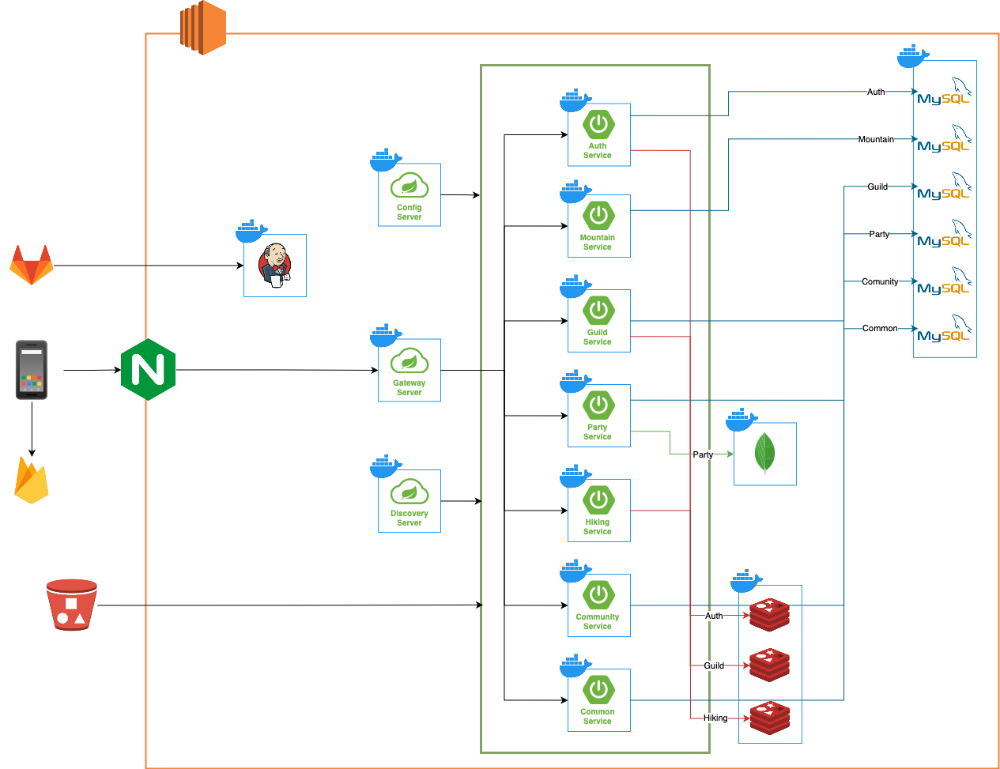

# 🏔 산뜻

#### 등산 종합 서비스 앱

<br />

## 🕞 프로젝트 진행 기간

**2024.04.08 ~ 2024.05.20** (6주)

<br />

### 기획배경

등산은 가고 싶고, 위험할까 걱정이 되시나요?
'산뜻'에서 동호회 사람들과 함께 떠나보는 건 어떨까요?

회원들의 위치는 물론 위험 신호를 보내 위험한 상황에서 도움을 받을 수 있습니다!

<br />

## 💬 주요 기능

1. 등산 관련 정보 제공

    - 산, 코스, 날씨 정보

2. 등산 커뮤니티 기능

    - 동호회, 소모임
        - 지역별, 나이별, 성별 그룹으로 동호회 생성
        - 실제 산, 코스 정보를 선택하여 등산 일정 생성 및 관리
        - 회원관리, 채팅
    - 게시판
        - 동호회, 등산 Tip, 코스 공유

3. 등산 보조 기능

    - 사용자 간 실시간 위치 공유
    - 갤럭시 워치를 활용한 건강 데이터 측정
    - 경로 이탈 시 위험 신호
    - 신체 데이터를 활용한 위험 신호

4. 기타 기능
    - 사진 촬영으로 식물 정보 검색
    - 등산 기록, 랭킹

<br />

## 📱 서비스 화면

0. 로그인, 회원가입

1. 홈 화면

2. 커뮤니티 (게시판 \* 4)

3. 마이 페이지 (\*3)

4. 동호회 생성, 관리

5. 소모임 생성, 관리

6. 등산

7. 식물 검색

8.

9.

<br />

## 👩‍💻 개발 환경

<a name="item-three"></a>

|                                                일정관리                                                 |                                               형상관리                                                |                                                커뮤니케이션                                                |                                                  디자인                                                   |
| :-----------------------------------------------------------------------------------------------------: | :---------------------------------------------------------------------------------------------------: | :--------------------------------------------------------------------------------------------------------: | :-------------------------------------------------------------------------------------------------------: |
|  |  |  |  |

<br />

#### **IDE**

 

<br />

#### **Frontend**

  
   
 
   
  

<br />

#### **Backend**

  
    
   

<br />

#### **DevOPS**

   

<br />

## 🏢 아키텍처



## 📂 프로젝트 파일 구조

<details>
<summary><b>FrontEnd - Android</b></summary>

```
📦santeut
 ┣ 📂data
 ┃ ┣ 📂apiservice
 ┃ ┃ ┣ 📜AuthApiService.kt
 ┃ ┃ ┣ 📜CommonApiService.kt
 ┃ ┃ ┣ 📜GuildApiService.kt
 ┃ ┃ ┣ 📜HikingApiService.kt
 ┃ ┃ ┣ 📜MountainApiService.kt
 ┃ ┃ ┣ 📜PartyApiService.kt
 ┃ ┃ ┣ 📜PlantIdApi.kt
 ┃ ┃ ┣ 📜PostApiService.kt
 ┃ ┃ ┣ 📜UserApiService.kt
 ┃ ┃ ┗ 📜WeatherApi.kt
 ┃ ┣ 📂di
 ┃ ┃ ┣ 📜AppModule.kt
 ┃ ┃ ┣ 📜RemoteModule.kt
 ┃ ┃ ┣ 📜RepositoryModule.kt
 ┃ ┃ ┗ 📜WebSocketClient.kt
 ┃ ┣ 📂model
 ┃ ┃ ┣ 📂request
 ┃ ┃ ┃ ┣ 📜CreateCommentRequest.kt
 ┃ ┃ ┃ ┣ 📜CreatePartyRequest.kt
 ┃ ┃ ┃ ┣ 📜CreatePostRequest.kt
 ┃ ┃ ┃ ┣ 📜EndHikingRequest.kt
 ┃ ┃ ┃ ┣ 📜FCMTokenRequest.kt
 ┃ ┃ ┃ ┣ 📜GuildRequest.kt
 ┃ ┃ ┃ ┣ 📜LoginRequest.kt
 ┃ ┃ ┃ ┣ 📜PartyIdRequest.kt
 ┃ ┃ ┃ ┣ 📜PlantIdentificationRequest.kt
 ┃ ┃ ┃ ┣ 📜SignUpRequest.kt
 ┃ ┃ ┃ ┣ 📜StartHikingRequest.kt
 ┃ ┃ ┃ ┗ 📜WebSocketSendMessageRequest.kt
 ┃ ┃ ┣ 📂response
 ┃ ┃ ┃ ┣ 📜AllcourseResponse.kt
 ┃ ┃ ┃ ┣ 📜ChatResponse.kt
 ┃ ┃ ┃ ┣ 📜CommentResponse.kt
 ┃ ┃ ┃ ┣ 📜CoursePostDetailResponse.kt
 ┃ ┃ ┃ ┣ 📜GuildResponse.kt
 ┃ ┃ ┃ ┣ 📜HikingResponse.kt
 ┃ ┃ ┃ ┣ 📜LocationData.kt
 ┃ ┃ ┃ ┣ 📜LoginResponse.kt
 ┃ ┃ ┃ ┣ 📜MountainResponse.kt
 ┃ ┃ ┃ ┣ 📜MyCourseResponse.kt
 ┃ ┃ ┃ ┣ 📜MyProfileResponse.kt
 ┃ ┃ ┃ ┣ 📜PartyCourseResponse.kt
 ┃ ┃ ┃ ┣ 📜PartyResponse.kt
 ┃ ┃ ┃ ┣ 📜PostResponse.kt
 ┃ ┃ ┃ ┣ 📜ReadPostResponse.kt
 ┃ ┃ ┃ ┣ 📜UserLocationDataResponse.kt
 ┃ ┃ ┃ ┗ 📜WebSocketMessageResponse.kt
 ┃ ┃ ┣ 📜ApiResult.kt
 ┃ ┃ ┗ 📜CustomResponse.kt
 ┃ ┣ 📂repository
 ┃ ┃ ┣ 📜AuthRepository.kt
 ┃ ┃ ┣ 📜AuthRepositoryImpl.kt
 ┃ ┃ ┣ 📜CommonRepository.kt
 ┃ ┃ ┣ 📜CommonRepositoryImpl.kt
 ┃ ┃ ┣ 📜GuildRepository.kt
 ┃ ┃ ┣ 📜GuildRepositoryImpl.kt
 ┃ ┃ ┣ 📜HikingRepository.kt
 ┃ ┃ ┣ 📜HikingRepositoryImpl.kt
 ┃ ┃ ┣ 📜MountainRepository.kt
 ┃ ┃ ┣ 📜MountainRepositoryImpl.kt
 ┃ ┃ ┣ 📜PartyRepository.kt
 ┃ ┃ ┣ 📜PartyRepositoryImpl.kt
 ┃ ┃ ┣ 📜PostRepository.kt
 ┃ ┃ ┣ 📜PostRepositoryImpl.kt
 ┃ ┃ ┣ 📜UserRepository.kt
 ┃ ┃ ┗ 📜UserRepositoryImpl.kt
 ┃ ┗ 📂util
 ┃ ┃ ┣ 📜AuthInterceptor.kt
 ┃ ┃ ┣ 📜CameraX.kt
 ┃ ┃ ┣ 📜CameraXFactory.kt
 ┃ ┃ ┣ 📜CameraXImpl.kt
 ┃ ┃ ┣ 📜RecordingInfo.kt
 ┃ ┃ ┣ 📜RecordingState.kt
 ┃ ┃ ┗ 📜SharedPreferencesUtil.kt
 ┣ 📂designsystem
 ┃ ┗ 📂theme
 ┃ ┃ ┣ 📜Color.kt
 ┃ ┃ ┣ 📜Theme.kt
 ┃ ┃ ┣ 📜Type.kt
 ┃ ┃ ┗ 📜Typography.kt
 ┣ 📂domain
 ┃ ┗ 📂usecase
 ┃ ┃ ┣ 📜CommonUseCase.kt
 ┃ ┃ ┣ 📜FCMTokenUseCase.kt
 ┃ ┃ ┣ 📜GuildUseCase.kt
 ┃ ┃ ┣ 📜HikingUseCase.kt
 ┃ ┃ ┣ 📜LoginUseCase.kt
 ┃ ┃ ┣ 📜MountainUseCase.kt
 ┃ ┃ ┣ 📜PartyUseCase.kt
 ┃ ┃ ┣ 📜PostUseCase.kt
 ┃ ┃ ┣ 📜SignUpUseCase.kt
 ┃ ┃ ┗ 📜UserUseCase.kt
 ┣ 📂ui
 ┃ ┣ 📂chat
 ┃ ┃ ┣ 📜ChatListScreen.kt
 ┃ ┃ ┣ 📜ChatScreen.kt
 ┃ ┃ ┣ 📜ChatViewModel.kt
 ┃ ┃ ┗ 📜Message.kt
 ┃ ┣ 📂community
 ┃ ┃ ┣ 📂common
 ┃ ┃ ┃ ┣ 📜CommentScreen.kt
 ┃ ┃ ┃ ┗ 📜ReadPostScreen.kt
 ┃ ┃ ┣ 📂course
 ┃ ┃ ┃ ┣ 📜CreateCoursePostScreen.kt
 ┃ ┃ ┃ ┣ 📜FindHikingHistory.kt
 ┃ ┃ ┃ ┣ 📜PostCourseScreen.kt
 ┃ ┃ ┃ ┗ 📜ReadCoursePostScreen.kt
 ┃ ┃ ┣ 📂guild
 ┃ ┃ ┃ ┗ 📜JoinGuildScreen.kt
 ┃ ┃ ┣ 📂party
 ┃ ┃ ┃ ┗ 📜JoinPartyScreen.kt
 ┃ ┃ ┣ 📂tips
 ┃ ┃ ┃ ┣ 📜CreateTipPostScreen.kt
 ┃ ┃ ┃ ┗ 📜PostTipsScreen.kt
 ┃ ┃ ┣ 📜CommonViewModel.kt
 ┃ ┃ ┣ 📜CommunityScreen.kt
 ┃ ┃ ┗ 📜PostViewModel.kt
 ┃ ┣ 📂guild
 ┃ ┃ ┣ 📜CreateGuildPostScreen.kt
 ┃ ┃ ┣ 📜CreateGuildScreen.kt
 ┃ ┃ ┣ 📜GuildApplyListScreen.kt
 ┃ ┃ ┣ 📜GuildCommunityScreen.kt
 ┃ ┃ ┣ 📜GuildInfoScreen.kt
 ┃ ┃ ┣ 📜GuildMemberListScreen.kt
 ┃ ┃ ┣ 📜GuildPostDetailScreen.kt
 ┃ ┃ ┣ 📜GuildRankingScreen.kt
 ┃ ┃ ┣ 📜GuildScreen.kt
 ┃ ┃ ┣ 📜GuildViewModel.kt
 ┃ ┃ ┣ 📜MyGuildListScreen.kt
 ┃ ┃ ┣ 📜MyGuildScreen.kt
 ┃ ┃ ┗ 📜UpdateGuildScreen.kt
 ┃ ┣ 📂home
 ┃ ┃ ┣ 📜HomeScreen.kt
 ┃ ┃ ┗ 📜HomeViewModel.kt
 ┃ ┣ 📂landing
 ┃ ┃ ┣ 📜LandingScreen.kt
 ┃ ┃ ┣ 📜UserState.kt
 ┃ ┃ ┗ 📜UserViewModel.kt
 ┃ ┣ 📂login
 ┃ ┃ ┣ 📜LoginEvent.kt
 ┃ ┃ ┣ 📜LoginScreen.kt
 ┃ ┃ ┗ 📜LoginViewModel.kt
 ┃ ┣ 📂map
 ┃ ┃ ┣ 📜LocationModule.kt
 ┃ ┃ ┣ 📜MapScreen.kt
 ┃ ┃ ┣ 📜MapViewModel.kt
 ┃ ┃ ┣ 📜PlantViewModel.kt
 ┃ ┃ ┗ 📜SearchPlant.kt
 ┃ ┣ 📂mountain
 ┃ ┃ ┣ 📜MountainListScreen.kt
 ┃ ┃ ┣ 📜MountainScreen.kt
 ┃ ┃ ┗ 📜MountainViewModel.kt
 ┃ ┣ 📂mypage
 ┃ ┃ ┣ 📜MyHikingScreen.kt
 ┃ ┃ ┣ 📜MyPageScreen.kt
 ┃ ┃ ┣ 📜MyProfileScreen.kt
 ┃ ┃ ┣ 📜MyScheduleScreen.kt
 ┃ ┃ ┗ 📜UserViewModel.kt
 ┃ ┣ 📂navigation
 ┃ ┃ ┣ 📂bottom
 ┃ ┃ ┃ ┣ 📜BottomNavBar.kt
 ┃ ┃ ┃ ┣ 📜CommunityNavGraph.kt
 ┃ ┃ ┃ ┣ 📜GuildNavGraph.kt
 ┃ ┃ ┃ ┣ 📜HomeNavGraph.kt
 ┃ ┃ ┃ ┣ 📜MapNavGraph.kt
 ┃ ┃ ┃ ┣ 📜MountainNavGraph.kt
 ┃ ┃ ┃ ┗ 📜MyPageNavGraph.kt
 ┃ ┃ ┣ 📂top
 ┃ ┃ ┃ ┣ 📜TopBar.kt
 ┃ ┃ ┃ ┗ 📜TopNavGraph.kt
 ┃ ┃ ┣ 📜SanteutNavGraph.kt
 ┃ ┃ ┗ 📜UnAuthNavGraph.kt
 ┃ ┣ 📂noti
 ┃ ┃ ┗ 📜NotiScreen.kt
 ┃ ┣ 📂party
 ┃ ┃ ┣ 📜InputPartyInfoScreen.kt
 ┃ ┃ ┣ 📜MyPartyListScreen.kt
 ┃ ┃ ┣ 📜PartyViewModel.kt
 ┃ ┃ ┗ 📜SelectedMountain.kt
 ┃ ┣ 📂signup
 ┃ ┃ ┣ 📜SIgnUpEvent.kt
 ┃ ┃ ┣ 📜SignUpScreen.kt
 ┃ ┃ ┗ 📜SignUpViewModel.kt
 ┃ ┗ 📂wearable
 ┃ ┃ ┗ 📜WearableViewModel.kt
 ┣ 📜MainActivity.kt
 ┣ 📜MainApplication.kt
 ┣ 📜MyFirebaseMessagingService.kt
 ┗ 📜SanteutApp.kt
```

</details>

<details>
<summary><b>FrontEnd - Watch</b></summary>

```
📦santeut
 ┣ 📂data
 ┃ ┣ 📜ExerciseClientKtx.kt
 ┃ ┣ 📜ExerciseClientManager.kt
 ┃ ┗ 📜HealthServicesRepository.kt
 ┣ 📂design
 ┃ ┗ 📂theme
 ┃ ┃ ┗ 📜Theme.kt
 ┣ 📂di
 ┃ ┣ 📜BindService.kt
 ┃ ┣ 📜MainModule.kt
 ┃ ┗ 📜ServiceModule.kt
 ┣ 📂service
 ┃ ┣ 📜ExerciseLogger.kt
 ┃ ┣ 📜ExerciseNotificationManager.kt
 ┃ ┣ 📜ExerciseService.kt
 ┃ ┣ 📜ExerciseServiceMonitor.kt
 ┃ ┗ 📜ExerciseState.kt
 ┣ 📂ui
 ┃ ┣ 📂health
 ┃ ┃ ┣ 📜HealthScreen.kt
 ┃ ┃ ┣ 📜HealthScreenState.kt
 ┃ ┃ ┗ 📜HealthViewModel.kt
 ┃ ┣ 📂main
 ┃ ┃ ┣ 📜MainScreen.kt
 ┃ ┃ ┗ 📜MainViewModel.kt
 ┃ ┣ 📂map
 ┃ ┃ ┗ 📜MapScreen.kt
 ┃ ┣ 📜HealthDataViewModel.kt
 ┃ ┗ 📜WearableModule.kt
 ┣ 📜MainActivity.kt
 ┣ 📜MainApplication.kt
 ┗ 📜SanteutApp.kt
```

</details>

<details>
<summary><b>BackEnd</b></summary>

```
📦gateway
 ┣ 📂authorize
 ┃ ┗ 📜AuthorizationToken.java
 ┣ 📂filter
 ┃ ┣ 📜CustomFilter.java
 ┃ ┗ 📜GlobalFilter.java
 ┗ 📜GatewayApplication.java
```

```
📦community
┣ 📂common
┃ ┣ 📂config
┃ ┃ ┣ 📜AmazonConfig.java
┃ ┃ ┗ 📜FeignConfiguration.java
┃ ┣ 📂exception
┃ ┃ ┣ 📜AccessDeniedException.java
┃ ┃ ┣ 📜ApiExceptionController.java
┃ ┃ ┣ 📜FeignClientException.java
┃ ┃ ┣ 📜JpaQueryException.java
┃ ┃ ┣ 📜S3Exception.java
┃ ┃ ┗ 📜ZeroDataException.java
┃ ┣ 📂response
┃ ┃ ┣ 📜BasicResponse.java
┃ ┃ ┣ 📜ErrorResponse.java
┃ ┃ ┗ 📜PagingResponse.java
┃ ┗ 📂util
┃ ┃ ┗ 📜ResponseUtil.java
┣ 📂controller
┃ ┣ 📜CourseController.java
┃ ┗ 📜PostController.java
┣ 📂dto
┃ ┣ 📂request
┃ ┃ ┣ 📜PostCreateRequestDto.java
┃ ┃ ┗ 📜PostUpdateRequestDto.java
┃ ┗ 📂response
┃ ┃ ┣ 📜CourseReadResponseDto.java
┃ ┃ ┣ 📜PostListResponseDto.java
┃ ┃ ┣ 📜PostReadResponseDto.java
┃ ┃ ┗ 📜UserInfoFeignRequestDto.java
┣ 📂entity
┃ ┣ 📜BaseEntity.java
┃ ┗ 📜PostEntity.java
┣ 📂feign
┃ ┣ 📂dto
┃ ┃ ┣ 📜CommentListFeignDto.java
┃ ┃ ┗ 📜FeignPartyLatLngResponseDto.java
┃ ┣ 📂service
┃ ┃ ┣ 📜AuthServerService.java
┃ ┃ ┗ 📜CommonServerService.java
┃ ┣ 📜CommonClient.java
┃ ┣ 📜FeignResponseDto.java
┃ ┣ 📜JwtTokenFilter.java
┃ ┣ 📜JwtTokenInterceptor.java
┃ ┣ 📜PartyClient.java
┃ ┗ 📜UserInfoClient.java
┣ 📂repository
┃ ┗ 📜PostRepository.java
┣ 📂service
┃ ┣ 📜CourseService.java
┃ ┣ 📜ImageService.java
┃ ┗ 📜PostService.java
┗ 📜CommunityApplication.java

```

```
📦common
 ┣ 📂common
 ┃ ┣ 📂config
 ┃ ┃ ┣ 📜AmazonConfig.java
 ┃ ┃ ┣ 📜FeignConfiguration.java
 ┃ ┃ ┗ 📜FirebaseConfig.java
 ┃ ┣ 📂exception
 ┃ ┃ ┣ 📜AccessDeniedException.java
 ┃ ┃ ┣ 📜ApiExceptionController.java
 ┃ ┃ ┣ 📜DataNotFoundException.java
 ┃ ┃ ┣ 📜FeignClientException.java
 ┃ ┃ ┣ 📜FirebaseSettingFailException.java
 ┃ ┃ ┣ 📜RepositorySaveException.java
 ┃ ┃ ┣ 📜S3Exception.java
 ┃ ┃ ┗ 📜ZeroDataException.java
 ┃ ┣ 📂response
 ┃ ┃ ┣ 📜BasicResponse.java
 ┃ ┃ ┣ 📜ErrorResponse.java
 ┃ ┃ ┗ 📜PagingResponse.java
 ┃ ┗ 📂util
 ┃ ┃ ┣ 📜FcmUtils.java
 ┃ ┃ ┣ 📜GeoUtils.java
 ┃ ┃ ┗ 📜ResponseUtil.java
 ┣ 📂controller
 ┃ ┣ 📜AlarmController.java
 ┃ ┣ 📜AlarmTokenController.java
 ┃ ┣ 📜CommentController.java
 ┃ ┣ 📜ImageController.java
 ┃ ┗ 📜LikeController.java
 ┣ 📂dto
 ┃ ┣ 📂request
 ┃ ┃ ┣ 📜AlarmRequestDto.java
 ┃ ┃ ┣ 📜CommonHikingStartFeignRequest.java
 ┃ ┃ ┣ 📜CommunityFeignDto.java
 ┃ ┃ ┣ 📜GuildPostFeignDto.java
 ┃ ┃ ┣ 📜TokenRequestDto.java
 ┃ ┃ ┗ 📜UserInfoFeignRequestDto.java
 ┃ ┣ 📂response
 ┃ ┃ ┣ 📜AlarmListResponseDto.java
 ┃ ┃ ┗ 📜CommentListResponseDto.java
 ┃ ┣ 📜FCMCategory.java
 ┃ ┗ 📜FCMRequestDto.java
 ┣ 📂entity
 ┃ ┣ 📜AlarmEntity.java
 ┃ ┣ 📜AlarmTokenEntity.java
 ┃ ┣ 📜BaseEntity.java
 ┃ ┣ 📜CommentEntity.java
 ┃ ┣ 📜ImageEntity.java
 ┃ ┣ 📜LikeEntity.java
 ┃ ┗ 📜SafetyAlertEntity.java
 ┣ 📂feign
 ┃ ┣ 📂service
 ┃ ┃ ┗ 📜AuthServerService.java
 ┃ ┣ 📜CommunityClient.java
 ┃ ┣ 📜FeignResponseDto.java
 ┃ ┣ 📜GuildClient.java
 ┃ ┣ 📜JwtTokenFilter.java
 ┃ ┣ 📜JwtTokenInterceptor.java
 ┃ ┗ 📜UserInfoClient.java
 ┣ 📂repository
 ┃ ┣ 📜AlarmRepository.java
 ┃ ┣ 📜AlarmTokenRepository.java
 ┃ ┣ 📜CommentRepository.java
 ┃ ┣ 📜ImageRepository.java
 ┃ ┣ 📜LikeRepository.java
 ┃ ┗ 📜SafetyAlertRepository.java
 ┣ 📂service
 ┃ ┣ 📜AlarmService.java
 ┃ ┣ 📜AlarmTokenService.java
 ┃ ┣ 📜CommentService.java
 ┃ ┣ 📜ImageService.java
 ┃ ┗ 📜LikeService.java
 ┗ 📜CommonApplication.java

```

```
📦auth
 ┣ 📂common
 ┃ ┣ 📂exception
 ┃ ┃ ┣ 📜ApiExceptionController.java
 ┃ ┃ ┗ 📜DataNotFoundException.java
 ┃ ┣ 📂jwt
 ┃ ┃ ┣ 📜JwtFilter.java
 ┃ ┃ ┗ 📜JwtTokenProvider.java
 ┃ ┣ 📂response
 ┃ ┃ ┣ 📜BasicResponse.java
 ┃ ┃ ┣ 📜ErrorResponse.java
 ┃ ┃ ┣ 📜PagingResponse.java
 ┃ ┃ ┗ 📜ResponseCode.java
 ┃ ┣ 📂userDetail
 ┃ ┃ ┗ 📜CustomUserDetailsService.java
 ┃ ┗ 📂util
 ┃ ┃ ┗ 📜ResponseUtil.java
 ┣ 📂config
 ┃ ┣ 📜CorsConfig.java
 ┃ ┣ 📜RedisConfig.java
 ┃ ┣ 📜S3Config.java
 ┃ ┗ 📜SecurityConfig.java
 ┣ 📂controller
 ┃ ┣ 📜AuthController.java
 ┃ ┗ 📜UserController.java
 ┣ 📂dto
 ┃ ┣ 📂request
 ┃ ┃ ┣ 📜HikingRecordRequest.java
 ┃ ┃ ┣ 📜PartyMemberInfoRequest.java
 ┃ ┃ ┣ 📜SignInRequestDto.java
 ┃ ┃ ┣ 📜SignUpRequestDto.java
 ┃ ┃ ┣ 📜UpdatePasswordRequest.java
 ┃ ┃ ┣ 📜UpdateProfileImageRequest.java
 ┃ ┃ ┗ 📜UpdateProfileRequest.java
 ┃ ┗ 📂response
 ┃ ┃ ┣ 📜GetMountainRecordResponse.java
 ┃ ┃ ┣ 📜GetMypageProfileResponse.java
 ┃ ┃ ┣ 📜GetPartyMemberInfoResponse.java
 ┃ ┃ ┣ 📜GetUserInfoResponse.java
 ┃ ┃ ┣ 📜GetUserLevelResponse.java
 ┃ ┃ ┣ 📜JwtTokenResponseDto.java
 ┃ ┃ ┗ 📜SignInResponse.java
 ┣ 📂entity
 ┃ ┣ 📜Image.java
 ┃ ┣ 📜RefreshToken.java
 ┃ ┗ 📜UserEntity.java
 ┣ 📂feign
 ┣ 📂repository
 ┃ ┣ 📜RefreshTokenRepository.java
 ┃ ┗ 📜UserRepository.java
 ┣ 📂service
 ┃ ┣ 📂implementation
 ┃ ┃ ┣ 📜AuthServiceImpl.java
 ┃ ┃ ┗ 📜UserServiceImpl.java
 ┃ ┣ 📜AuthService.java
 ┃ ┗ 📜UserService.java
 ┣ 📂util
 ┃ ┣ 📜AgeUtil.java
 ┃ ┣ 📜ImageUtil.java
 ┃ ┗ 📜LevelUtil.java
 ┗ 📜AuthApplication.java
```

```
📦guild
 ┣ 📂common
 ┃ ┣ 📂exception
 ┃ ┃ ┣ 📜AccessDeniedException.java
 ┃ ┃ ┣ 📜ApiExceptionController.java
 ┃ ┃ ┣ 📜CategoryNotFoundException.java
 ┃ ┃ ┣ 📜DataNotFoundException.java
 ┃ ┃ ┗ 📜FeignClientException.java
 ┃ ┣ 📂response
 ┃ ┃ ┣ 📜BasicResponse.java
 ┃ ┃ ┣ 📜ErrorResponse.java
 ┃ ┃ ┣ 📜PagingResponse.java
 ┃ ┃ ┗ 📜ResponseCode.java
 ┃ ┗ 📂util
 ┃ ┃ ┗ 📜ResponseUtil.java
 ┣ 📂config
 ┃ ┣ 📜RedisConfig.java
 ┃ ┗ 📜S3Config.java
 ┣ 📂controller
 ┃ ┣ 📜GuildController.java
 ┃ ┣ 📜GuildPostController.java
 ┃ ┣ 📜GuildUserController.java
 ┃ ┗ 📜RankController.java
 ┣ 📂dto
 ┃ ┣ 📂request
 ┃ ┃ ┣ 📜CreateGuildRequest.java
 ┃ ┃ ┣ 📜GuildPostUpdateRequestDto.java
 ┃ ┃ ┣ 📜PatchGuildInfoRequest.java
 ┃ ┃ ┗ 📜PostCreateRequestDto.java
 ┃ ┗ 📂response
 ┃ ┃ ┣ 📜ApplyGuildListResponse.java
 ┃ ┃ ┣ 📜GetDetailGuildResponse.java
 ┃ ┃ ┣ 📜GetGuildListResponse.java
 ┃ ┃ ┣ 📜GetMyGuildResponse.java
 ┃ ┃ ┣ 📜GuildMemberListResponse.java
 ┃ ┃ ┣ 📜PartyMemberInfo.java
 ┃ ┃ ┣ 📜PostListResponseDto.java
 ┃ ┃ ┣ 📜PostReadResponseDto.java
 ┃ ┃ ┣ 📜RankMembersInfoResponse.java
 ┃ ┃ ┣ 📜RankUserInfo.java
 ┃ ┃ ┣ 📜SearchGuildListResponse.java
 ┃ ┃ ┣ 📜SearchGuildNameListResponse.java
 ┃ ┃ ┗ 📜UserInfoResponse.java
 ┣ 📂entity
 ┃ ┣ 📜BaseEntity.java
 ┃ ┣ 📜CategoryEntity.java
 ┃ ┣ 📜GuildEntity.java
 ┃ ┣ 📜GuildPostEntity.java
 ┃ ┣ 📜GuildRequestEntity.java
 ┃ ┣ 📜GuildUserEntity.java
 ┃ ┣ 📜Image.java
 ┃ ┗ 📜RegionEntity.java
 ┣ 📂feign
 ┃ ┣ 📂dto
 ┃ ┃ ┣ 📜AlarmRequestDto.java
 ┃ ┃ ┣ 📜CommentFeignDto.java
 ┃ ┃ ┣ 📜CommentListFeignDto.java
 ┃ ┃ ┣ 📜PartyMemberInfoRequest.java
 ┃ ┃ ┣ 📜PartyMemberInfoResponse.java
 ┃ ┃ ┗ 📜UserInfoFeignDto.java
 ┃ ┣ 📜AuthClient.java
 ┃ ┣ 📜CommonClient.java
 ┃ ┣ 📜FeignResponseDto.java
 ┃ ┗ 📜UserFeign.java
 ┣ 📂repository
 ┃ ┣ 📜CategoryRepository.java
 ┃ ┣ 📜GuildPostRepository.java
 ┃ ┣ 📜GuildRepository.java
 ┃ ┣ 📜GuildRequestRepository.java
 ┃ ┣ 📜GuildUserRepository.java
 ┃ ┗ 📜RegionRepository.java
 ┣ 📂service
 ┃ ┣ 📂implementation
 ┃ ┃ ┣ 📜GuildServiceImpl.java
 ┃ ┃ ┣ 📜GuildUserServiceImpl.java
 ┃ ┃ ┣ 📜PostServiceImpl.java
 ┃ ┃ ┗ 📜RankServiceImpl.java
 ┃ ┣ 📜GuildService.java
 ┃ ┣ 📜GuildUserService.java
 ┃ ┣ 📜PostService.java
 ┃ ┗ 📜RankService.java
 ┣ 📂util
 ┃ ┣ 📜ImageUtil.java
 ┃ ┗ 📜RegionUtil.java
 ┗ 📜GuildApplication.java
```

```
📦mountain
 ┣ 📂common
 ┃ ┣ 📂config
 ┃ ┣ 📂exception
 ┃ ┃ ┣ 📜ApiExceptionController.java
 ┃ ┃ ┗ 📜NotFoundException.java
 ┃ ┣ 📂response
 ┃ ┃ ┣ 📜BasicResponse.java
 ┃ ┃ ┣ 📜ErrorResponse.java
 ┃ ┃ ┣ 📜PagingDataResponse.java
 ┃ ┃ ┗ 📜PagingResponse.java
 ┃ ┗ 📂util
 ┃ ┃ ┣ 📜GeometryUtils.java
 ┃ ┃ ┗ 📜ResponseUtil.java
 ┣ 📂controller
 ┃ ┗ 📜MountainController.java
 ┣ 📂dto
 ┃ ┣ 📂request
 ┃ ┃ ┗ 📜PartyTrackDataReginRequest.java
 ┃ ┗ 📂response
 ┃ ┃ ┣ 📜AllCourseResponse.java
 ┃ ┃ ┣ 📜CourseCoordResponseDto.java
 ┃ ┃ ┣ 📜CourseInfoResponseDto.java
 ┃ ┃ ┣ 📜LocationData.java
 ┃ ┃ ┣ 📜MountainDetailResponseDto.java
 ┃ ┃ ┣ 📜MountainInfoResponseDto.java
 ┃ ┃ ┣ 📜MountainSearchResponseDto.java
 ┃ ┃ ┣ 📜PartyCourseResponse.java
 ┃ ┃ ┗ 📜SearchResultResponse.java
 ┣ 📂entity
 ┃ ┣ 📜CourseEntity.java
 ┃ ┗ 📜MountainEntity.java
 ┣ 📂feign
 ┣ 📂repository
 ┃ ┣ 📜CourseRepository.java
 ┃ ┗ 📜MountainRepository.java
 ┣ 📂service
 ┃ ┣ 📜CourseService.java
 ┃ ┣ 📜CourseServiceImpl.java
 ┃ ┣ 📜MountainService.java
 ┃ ┗ 📜MountainServiceImpl.java
 ┗ 📜MountainApplication.java
```

```
📦party
 ┣ 📂common
 ┃ ┣ 📂config
 ┃ ┃ ┣ 📜ChattingHandshakeInterceptor.java
 ┃ ┃ ┣ 📜FeignConfiguration.java
 ┃ ┃ ┣ 📜MyWebSocketHandler.java
 ┃ ┃ ┣ 📜QueryDslConfig.java
 ┃ ┃ ┣ 📜RedisConfig.java
 ┃ ┃ ┗ 📜WebSocketConfig.java
 ┃ ┣ 📂exception
 ┃ ┃ ┣ 📜AccessDeniedException.java
 ┃ ┃ ┣ 📜AlreadyJoinedException.java
 ┃ ┃ ┣ 📜ApiExceptionController.java
 ┃ ┃ ┣ 📜DataMismatchException.java
 ┃ ┃ ┣ 📜DataNotFoundException.java
 ┃ ┃ ┣ 📜FeignException.java
 ┃ ┃ ┣ 📜PartyExpiredException.java
 ┃ ┃ ┗ 📜PartyNotStartedException.java
 ┃ ┣ 📂response
 ┃ ┃ ┣ 📜BasicResponse.java
 ┃ ┃ ┣ 📜ErrorResponse.java
 ┃ ┃ ┣ 📜PagingDataResponse.java
 ┃ ┃ ┗ 📜PagingResponse.java
 ┃ ┣ 📂util
 ┃ ┃ ┣ 📜CollectionIdGenerator.java
 ┃ ┃ ┣ 📜GeometryUtils.java
 ┃ ┃ ┗ 📜ResponseUtil.java
 ┃ ┗ 📜HealthCheckController.java
 ┣ 📂controller
 ┃ ┣ 📜ChatController.java
 ┃ ┣ 📜HikingController.java
 ┃ ┣ 📜PartyController.java
 ┃ ┗ 📜PartyUserController.java
 ┣ 📂dto
 ┃ ┣ 📂chatting
 ┃ ┃ ┣ 📜ChatMessage.java
 ┃ ┃ ┣ 📜ChatMessageRequest.java
 ┃ ┃ ┣ 📜ChatMessageResponse.java
 ┃ ┃ ┗ 📜SocketDto.java
 ┃ ┣ 📂request
 ┃ ┃ ┣ 📜CreatePartyRequestDto.java
 ┃ ┃ ┣ 📜HikingEnterRequest.java
 ┃ ┃ ┣ 📜HikingExitRequest.java
 ┃ ┃ ┣ 📜HikingRecordRequest.java
 ┃ ┃ ┣ 📜HikingRecordRequestInterface.java
 ┃ ┃ ┣ 📜HikingSafetyRequest.java
 ┃ ┃ ┣ 📜LocationData.java
 ┃ ┃ ┣ 📜ModifyPartyRequestDto.java
 ┃ ┃ ┗ 📜TrackData.java
 ┃ ┗ 📂response
 ┃ ┃ ┣ 📜ChatMessageListResponse.java
 ┃ ┃ ┣ 📜ChatRoomListResponse.java
 ┃ ┃ ┣ 📜GetPartyUserIdResponse.java
 ┃ ┃ ┣ 📜HikingRecordResponse.java
 ┃ ┃ ┣ 📜HikingStartResponse.java
 ┃ ┃ ┣ 📜PartyByYearMonthResponse.java
 ┃ ┃ ┣ 📜PartyInfoResponseDto.java
 ┃ ┃ ┣ 📜PartyWithPartyUserIdResponse.java
 ┃ ┃ ┗ 📜SelectedCourseResponse.java
 ┣ 📂entity
 ┃ ┣ 📜BaseEntity.java
 ┃ ┣ 📜Party.java
 ┃ ┗ 📜PartyUser.java
 ┣ 📂feign
 ┃ ┣ 📂dto
 ┃ ┃ ┣ 📂request
 ┃ ┃ ┃ ┣ 📜CommonHikingStartFeignRequest.java
 ┃ ┃ ┃ ┣ 📜GetPartyMemberInfoRequest.java
 ┃ ┃ ┃ ┣ 📜HikingRecordRequest.java
 ┃ ┃ ┃ ┣ 📜HikingTrackSaveFeignRequestDto.java
 ┃ ┃ ┃ ┣ 📜MountainCourseFeignRequest.java
 ┃ ┃ ┃ ┗ 📜PartyTrackDataFeginRequest.java
 ┃ ┃ ┗ 📂response
 ┃ ┃ ┃ ┣ 📜FeignResponseDto.java
 ┃ ┃ ┃ ┣ 📜GetPartyMemberInfoResponse.java
 ┃ ┃ ┃ ┣ 📜GuildInfoFeignResponseDto.java
 ┃ ┃ ┃ ┣ 📜HikingTrackResponse.java
 ┃ ┃ ┃ ┗ 📜UserInfoFeignResponseDto.java
 ┃ ┣ 📜FeignResponseDto.java
 ┃ ┣ 📜GuildAccessUtil.java
 ┃ ┣ 📜GuildClient.java
 ┃ ┣ 📜HikingAuthClient.java
 ┃ ┣ 📜HikingCommonClient.java
 ┃ ┣ 📜HikingMountainClient.java
 ┃ ┣ 📜JwtTokenFilter.java
 ┃ ┣ 📜JwtTokenInterceptor.java
 ┃ ┣ 📜UserInfoAccessUtil.java
 ┃ ┗ 📜UserInfoClient.java
 ┣ 📂repository
 ┃ ┣ 📜ChatMessageRepository.java
 ┃ ┣ 📜PartyRepository.java
 ┃ ┣ 📜PartyRepositoryCustom.java
 ┃ ┣ 📜PartyRepositoryImpl.java
 ┃ ┣ 📜PartyUserRepository.java
 ┃ ┗ 📜RoomRepository.java
 ┣ 📂service
 ┃ ┣ 📜ChatService.java
 ┃ ┣ 📜ChatServiceImpl.java
 ┃ ┣ 📜HikingService.java
 ┃ ┣ 📜PartyService.java
 ┃ ┣ 📜PartyServiceImpl.java
 ┃ ┣ 📜PartyUserService.java
 ┃ ┗ 📜PartyUserServiceImpl.java
 ┣ 📂vo
 ┃ ┗ 📜Room.java
 ┗ 📜PartyApplication.java
```

</details>

<br />

## 📑 프로젝트 산출물

-   [아키텍처](./documents/산뜻_아키텍처.png)
-   [ER Diagram](./documents/산뜻_ERD.png)
-   [UCC](https://youtu.be/j2zv7wjKVw4)
-   [포팅메뉴얼](./exec/)

<br />

## 👨‍👨‍👧👨‍👨‍👧 팀원

|                             FE/BE                              |                             BE/FE                              |                               BE                               |                               FE                               |                               BE                               |                               BE                               |                               FE                               |
| :------------------------------------------------------------: | :------------------------------------------------------------: | :------------------------------------------------------------: | :------------------------------------------------------------: | :------------------------------------------------------------: | :------------------------------------------------------------: | :------------------------------------------------------------: |
|                           **박나린**                           |                           **김가영**                           |                           **김동우**                           |                           **김영대**                           |                           **양윤모**                           |                           **주혜련**                           |                           **최용훈**                           |
|  |  |  |  |  |  |  |
|               DevOps <br/> UI/UX <br/> MSA 설계                |                            BackEnd                             |                            BackEnd                             |                            FrontEnd                            |                            BackEnd                             |                            BackEnd                             |                            FrontEnd                            |
