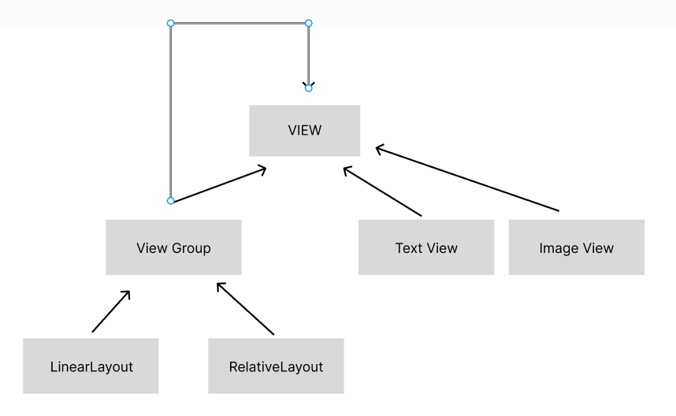

# 04/26(목)
## android studio
1. 기본 test app 구성
    - @Composable : 뷰의 개념으로 실제 screen에 보여지는 부분을 지정한다.
    - @Preview : 빌드되기 전 간이적으로 보여주는 창(미리보기를 위해 정의 되어 있는 screen창을 지정한다)
    - setContent : 컴파일 후 빌드 되어 보여지는 실제로 작동하는 영역

2. Compose의 구성(Column, Row, Box)
    - Column : 세로열의 구성으로 실제 보여지는 부분의 형태를 세로로 구성하고 보여준다.
    - Row : 행의 구성으로 실제 보여지는 부분의 형태를 가로로 구성하고 보여준다.
    - Box : Layout 상 여러 위제를 겹처서 놓을 수 있는 구성이다. 
3. modifier
    - Compose UI 요소에 동작을 장식하거나 추가하는 순서 있고 변경할 수 없는 컬렉션
    - EX)padding, backgroundcolor....
4. dp, sp
    - dp : (Density-Independent Pixels)는 UI 레이아웃을 정의할 때 레이아웃 치수나 위치를 지정하기 위해 사용하는 단위이다. 픽셀 독립 단위이며 화면의 크기가 달라도 동일한 비율로 보여주기 위해 안드로이드에서 정의한 단위이며 큰 화면, 작은 화면에 상관없이 같은 크기로 나타난다.
    - sp : (Scale-Independent Pixels)는 UI 레이아웃을 정의할 때 텍스트의 크기를 지정하기 위해 사용하는 단위이다.
    - 안드로이드 설정 화면에서 사용자는 안드로이스 시스템 전체에서 보여지는 텍스트의 크기를 선택하여 설정할 수 있는데 SP는 해당 설정에 영향을 받는다. 예를 들어, 시스템 설정에서 텍스트 크기를
"최대 크케"로 설정하게 되면 UI 레이아웃을 정의할 때 SP로 크기를 지정해놓은 TextView의 텍스트 크기가 영향을 받아 커진다. 반면에 TextView의 텍스트 크기를 DP로 설정하게 되면 시스템 설정의 텍스트 크기 값의 변화에 상관없이 일정한 크기를 유지한다.

# 04/27(금)
## 지도 구현하기

1. google map 
    - 호환성이 좋고 docs에 api 설명이 잘 되어 있다.
    - 우리가 필요한 산에 대한 길 안내가 잘 안되어 있어 사용하기 힘들거 같다.
    - 
    - metadata에 구글관련 api의 형식에 맞게 작성한 뒤 local.properties에 api키를 숨겨 보안을 강화할 수 있다.
   - app 단위 gradle에서 implementation의 버전을 잘 확인하고 호환되는 기종과 맞추는게 중요하다.

2. naver map
    - 초기 naver 의 지도는 compose의 형식을 지원하지 않았지만 현재는 라이브러리로 제공되고 있어 편리하게 사용할 수 있다.\
    - gradle에서 버전을 잘 확인하고 
    implementation ("io.github.fornewid:naver-map-location:21.0.1")
    implementation ("io.github.fornewid:naver-map-compose:1.7.0")
    implementation("com.naver.maps:map-sdk:3.18.0")
    settings.gradle에서 확인해야 한다.
    maven("https://naver.jfrog.io/artifactory/maven/")
    maven("https://repository.map.naver.com/archive/maven")

- 기본 코드에서 compose의 형태로 바꾸는 과정이 생각보다 쉽지 않아 계속 시도해 봐야 할거 같다.

# 04/29(월)

## kotlin 학습
1. 기본 구성
    - 액티비티 : 화면을 구성하는 컴포넌트
    - 서비스 : 백그라운드 작업을 하는 컴포넌트
    - 콘텐츠 프로바이더 : 앱의 데이터를 공유하는 컴포넌트
    - 브로드 캐스트 리시버 : 시스템 이벤트가 발생할 때 실행되는 컴포넌트
2. 파일 구성
    - androidMainfest.xml : 앱 환경 설정 파일
    - MainActivity : 메인 액티비티 파일
    - Project 단 build.gradle : 빌드 설정 파일
    - Module 단 build.gradle : 빌드 설정 파일 (기본적인 설정은 대부분 여기에 속한다)
    - res : 리소스 폴더
    - res/drawable : 이미지 리소스
    - res/layout : UI 구성에 필요한 xml
    - cf) 자바 이름은 숫자로 시작할 수 없다, 파일 이름은 소문자(대문자 사용불가능), 단어를 이을 때는 '_'를 사용한다
3. 뷰 객체의 계층 구조

    - View : 모든 뷰 클래스의 최상위 클래스, Activity는 View의 서브클래스만 화면에 출력
    - ViewGroup : View 의 하위 클래스지만 자체 UI는 없어서 화면에 출력해도 아무것도 없음, 다른 뷰 여러개를 묶어서 제어할 목적으로 사용, 일종의 컨테이너 기능을 담당.
4. 제트팩 - 구글에서 안드로이드 앱 개발용으로 제공하는 다양한 라이러리 모음
    - androidx.appcompat : 앱의 API 레벨 호환성을 해결
    - androidx.recyclerView : 목록 화면을 구성합니다.
    - androidx.viewpager2 : 스와이프로 넘기는 화면을 구성합니다.
    - androidx.fragment : 액티비티처럼 동작하는 뷰를 제공합니다.
    - androidx.drawearlayout : 옆에서 서랍처럼 열리는 화면을 구성